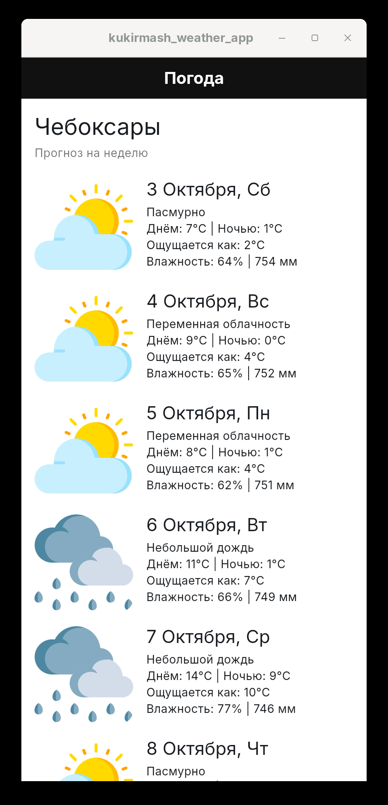
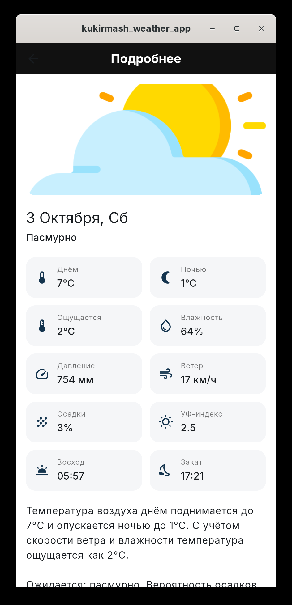
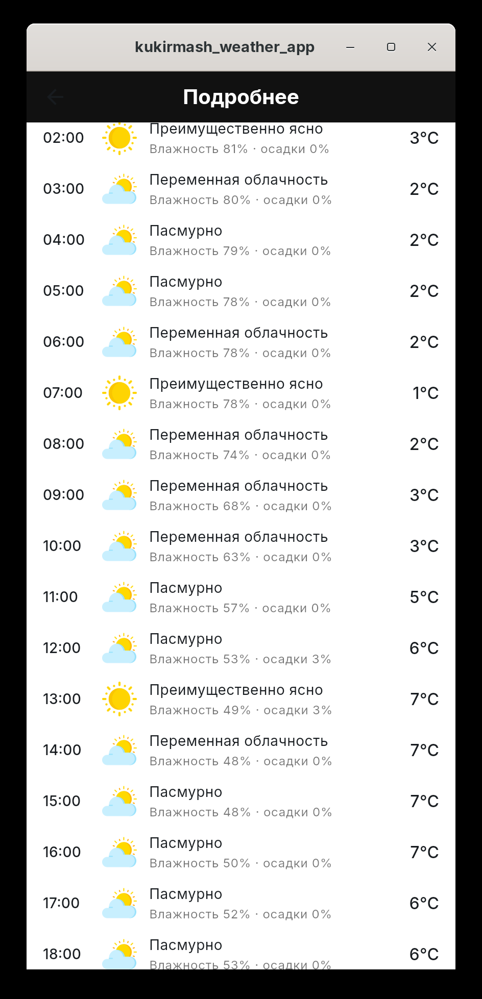
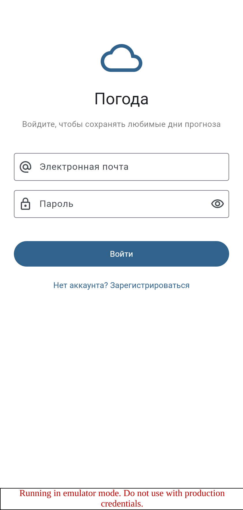
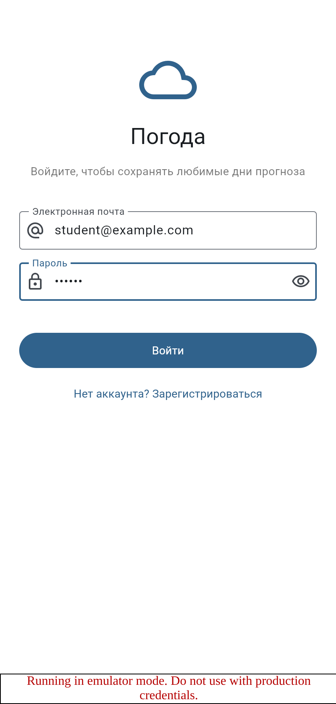
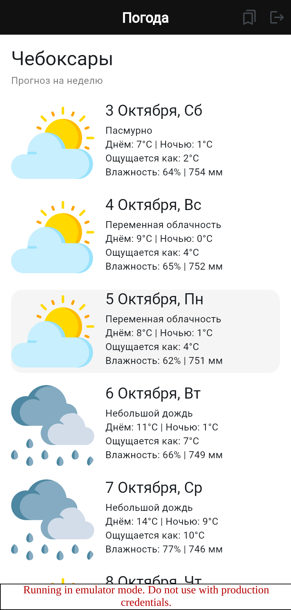
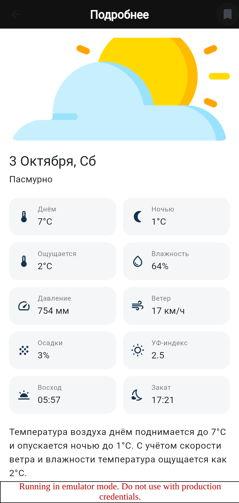
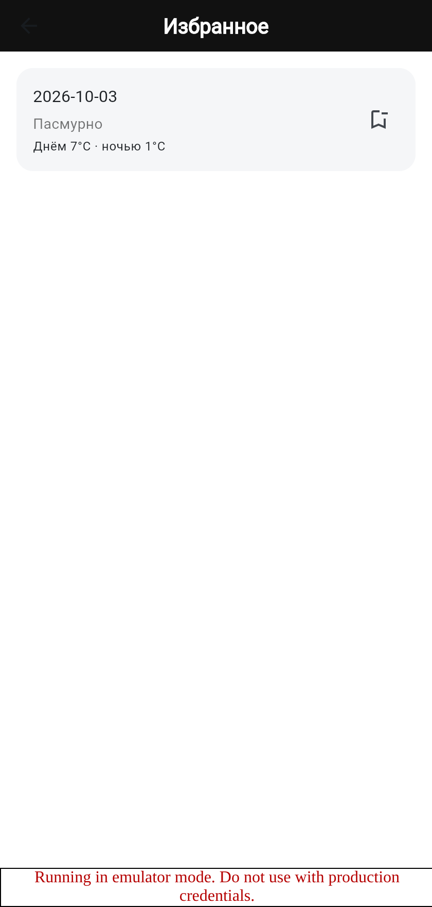

# Kukirmash Weather App

Кроссплатформенное приложение прогноза погоды на Flutter, разработанное в рамках
курса «Кроссплатформенные средства разработки».

**Предметная область:** прогноз погоды.
**Внешний API:** [Open-Meteo](https://open-meteo.com/) — открытый API прогноза
погоды, не требующий ключа. Точка расчёта — Чебоксары (56.13, 47.25).
**Firebase:** Authentication (вход по электронной почте и паролю) и
Cloud Firestore (избранные дни прогноза).

## Возможности

* список дней прогноза на неделю (первый экран);
* подробная информация о выбранном дне: сетка показателей, текстовое описание и
  почасовой прогноз (второй экран);
* навигация между экранами по идентификатору дня;
* регистрация и вход по электронной почте и паролю;
* сохранение понравившихся дней в избранное и их просмотр;
* обновление прогноза жестом pull-to-refresh;
* логирование HTTP-запросов, маршрутов и состояний блоков в talker.

## Скриншоты

| Первый экран | Второй экран | Почасовой прогноз |
| --- | --- | --- |
|  |  |  |

| Вход | Регистрация | Главный экран после входа |
| --- | --- | --- |
|  |  |  |

| Добавление дня в избранное | Список избранного |
| --- | --- |
|  |  |

## Используемые технологии

| Библиотека | Назначение |
| --- | --- |
| `go_router` | навигация и маршрутизация |
| `get_it` | внедрение зависимостей (DI) |
| `dio` | HTTP-клиент для запросов к API |
| `flutter_bloc`, `equatable` | управление состоянием по архитектуре BLoC |
| `json_annotation`, `json_serializable`, `build_runner` | генерация сериализации моделей |
| `talker`, `talker_flutter`, `talker_dio_logger`, `talker_bloc_logger` | логирование |
| `firebase_core`, `firebase_auth`, `cloud_firestore` | аутентификация и база данных |

## Архитектура

Приложение разделено на слой представления (`lib/app`) и слой данных (`lib/data`),
связь между ними обеспечивают репозитории и блоки, зарегистрированные в `lib/di/di.dart`.

```
lib/
├── app/                        # слой представления
│   ├── extensions/             # вспомогательные расширения (отступы)
│   ├── features/               # экраны и их бизнес-логика
│   │   ├── auth/               # экран входа и регистрации + AuthBloc
│   │   ├── details/            # второй экран (детали дня) + DetailsBloc
│   │   ├── favorites/          # экран избранного + FavoritesBloc
│   │   └── home/               # первый экран (список дней) + HomeBloc
│   ├── router/                 # маршруты go_router и защита маршрутов
│   ├── theme/                  # цвета и тема приложения
│   ├── widgets/                # переиспользуемые виджеты
│   └── app.dart                # экспорт содержимого папки
├── data/                       # слой данных
│   ├── auth/                   # репозиторий аутентификации
│   ├── dio/                    # настройка HTTP-клиента
│   ├── endpoints.dart          # конечные точки API
│   ├── favorites/              # репозиторий избранного (Firestore)
│   ├── firebase/               # инициализация Firebase и firebase_options.dart
│   └── forecast/               # модели, DTO ответа и репозиторий прогноза
├── di/di.dart                  # регистрация всех зависимостей
├── main.dart                   # точка входа
└── kukirmash_weather_app.dart  # корневой виджет приложения
```

### Запросы к API

| Запрос | Назначение | Пример |
| --- | --- | --- |
| Список элементов | прогноз на 7 дней | `/forecast?daily=...&forecast_days=7` |
| Элемент по id | подробности одного дня | `/forecast?daily=...&hourly=...&start_date=2026-10-03&end_date=2026-10-03` |

Идентификатором дня служит дата в формате ISO (`2026-10-03`), она же используется
как идентификатор документа в Cloud Firestore.

### Структура данных в Cloud Firestore

```
users/{uid}/favorites/{date}
    date:             "2026-10-03"        // дата дня
    condition:        "Пасмурно"          // описание погоды
    temperatureMax:   7.0                 // дневная температура, °C
    temperatureMin:   1.0                 // ночная температура, °C
    addedAt:          "2026-10-03T..."    // когда добавлено
```

Правила безопасности (`Rules`) разрешают доступ только авторизованным пользователям:

```
rules_version = '2';

service cloud.firestore {
  match /databases/{database}/documents {
    match /{document=**} {
      allow read, write: if request.auth != null;
    }
  }
}
```

## Запуск

```bash
cd kukirmash_weather_app
flutter pub get

# генерация кода сериализации моделей
dart run build_runner build

flutter run           # текущая платформа
flutter run -d linux  # Linux
flutter run -d chrome # Web
```

## Настройка Firebase

1. Создать проект в [консоли Firebase](https://console.firebase.google.com/).
2. В разделе **Authentication → Sign-in method** включить способ входа
   «Электронная почта/пароль».
3. В разделе **Firestore Database** создать базу данных и задать правила из
   раздела выше.
4. Связать проект с приложением:

   ```bash
   dart pub global activate flutterfire_cli
   flutterfire configure
   ```

   Команда создаст `lib/data/firebase/firebase_options.dart` — замените им
   файл-заглушку из репозитория.

5. Запустить приложение. До настройки Firebase приложение продолжает работать,
   а экран входа сообщает о недоступности сервиса.

### Локальные эмуляторы Firebase

Для отладки без реального проекта можно использовать Firebase Emulator Suite:

```bash
firebase emulators:start --only auth,firestore --project demo-kukirmash
flutter run --dart-define=USE_FIREBASE_EMULATORS=true
```

При `USE_FIREBASE_EMULATORS=true` приложение подключается к эмуляторам
Authentication (`127.0.0.1:9099`) и Cloud Firestore (`127.0.0.1:8080`).

> FlutterFire поддерживает Android, iOS, macOS, Web и Windows.
> На Linux плагины Firebase недоступны, поэтому там приложение работает в режиме
> без аутентификации: экран входа выводит соответствующее сообщение.

## Соответствие лабораторным работам

| Работа | Что реализовано |
| --- | --- |
| №1 | создание и запуск Flutter-проекта |
| №2 | вёрстка первого экрана, тема, DI, навигация, логгер |
| №3 | второй экран (детали дня) и переход на него |
| №4 | Dio, модели и репозиторий прогноза, HomeBloc первого экрана |
| №5 | запрос подробностей дня по id, DetailsBloc второго экрана |
| №6 | Firebase: Authentication, Cloud Firestore, экран входа и избранное |

Отчёты по работам находятся в папке `docs/`.
